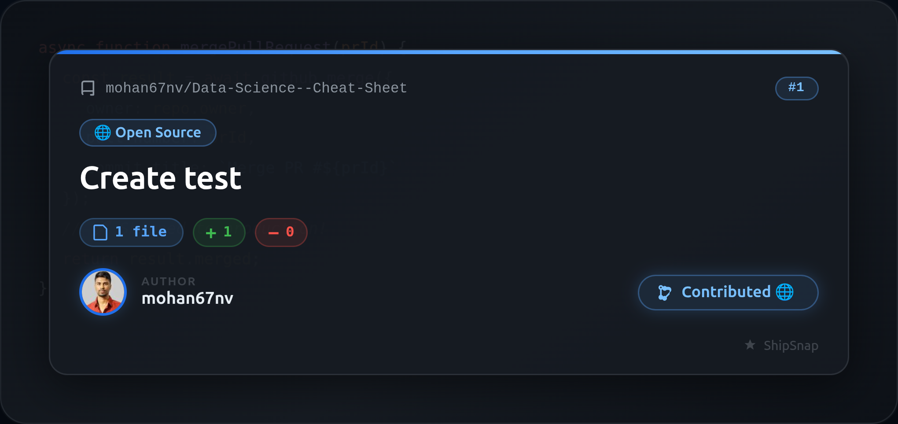
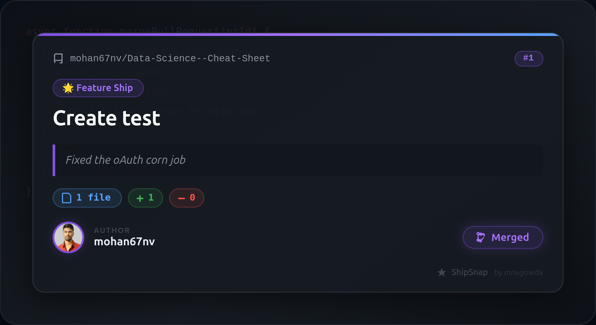
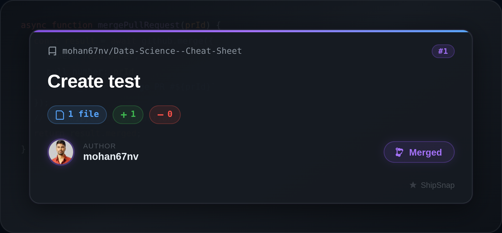
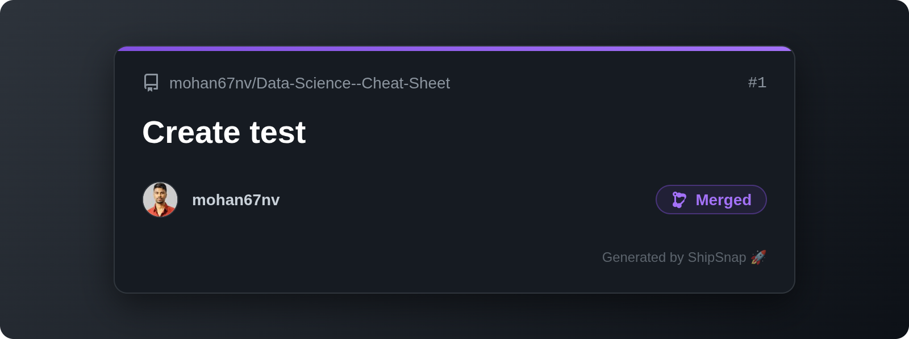

# ShipSnap 🌟

<div align="center">
  
  <br>
  <b>Turn your GitHub Pull Requests into beautiful, shareable cards — instantly.</b>
</div>

<br>

[](LICENSE)
[](https://developer.chrome.com/docs/extensions/mv3/)

ShipSnap is a Chrome Extension that injects a **📸 Share PR** button into every GitHub Pull Request page. Click it to generate a premium, dark-mode card with your PR stats, language badges, and a custom caption — then download it or share it directly to X (Twitter) or LinkedIn.

Build your personal brand as a developer. Ship publicly. 🌐

---

## ✨ Features

- **One-click injection:** Adds a "Share PR" button directly on GitHub PR pages
- **Real stats:** Fetches actual files changed, additions, and deletions via GitHub API
- **Language badges:** Auto-detects repo languages with per-language colour coding
- **4 Card Themes:** 🌟 Feature Ship · 🐛 Bug Squash · ⚡ Perf Win · 🌐 Open Source
- **Live Preview:** Write a custom caption and see the card update in real time
- **3× PNG download:** Crystal-clear image optimized for social media
- **One-click social sharing:** Share on X or LinkedIn with pre-filled, emoji-rich post text
- **100% client-side:** No servers, no tracking, no data leaves your browser

## 📸 More Examples

<div style="display: flex; gap: 10px;">
  
  
  
</div>

---

## 🖥 Installation

Currently in Developer Mode (Chrome Web Store listing pending):

1. Clone this repo:
   ```bash
   git clone https://github.com/mohan67nv/ShipSnap.git
   cd ShipSnap
   ```
2. Open Chrome and navigate to `chrome://extensions/`
3. Enable **Developer mode** (top right toggle)
4. Click **Load unpacked** and select the `src` folder inside the cloned directory
5. Navigate to any GitHub PR page — you'll see the **📸 Share PR** button appear!

---

## 🔒 Privacy

ShipSnap is **100% client-side**:
- No analytics, no telemetry, no accounts.
- PR data is stored only in `chrome.storage.local` (your browser).
- GitHub API calls are made directly from your browser with no intermediary server.

## 🤝 Contributing

Contributions, issues, and feature requests are welcome! Feel free to check [issues page](https://github.com/mohan67nv/ShipSnap/issues).

## 📜 License

[MIT License](LICENSE) - Copyright (c) 2024 Mohana Nyamanahalli Venkatesha

---
